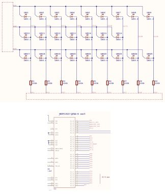

# Micro:bit hand assemble

This page describe how to make a program without programming environment.

# Tool

 - PC(Windows, Mac, Linux)
 - Notebook
 - Pencil
 - Binary editor

# Documents

https://infocenter.nordicsemi.com/pdf/nRF51822_PS_v3.3.pdf?cp=4_4_0_0

https://infocenter.nordicsemi.com/pdf/nRF51_RM_v3.0.1.pdf?cp=4_2_0

https://static.docs.arm.com/ddi0419/d/DDI0419D_armv6m_arm.pdf

https://github.com/bbcmicrobit/hardware/blob/master/SCH_BBC-Microbit_V1.3B.pdf

# How to light LED

## 1. About hardware

First, we need to know about processor information which Micro:bit use.  
https://tech.microbit.org/hardware/

## 2. Pin information

This document shows information that which pins connect to LEDs.

https://github.com/bbcmicrobit/hardware/blob/master/SCH_BBC-Microbit_V1.3B.pdf

These pins (P0.04 ~ P0.15) connected LEDs.

## Instruction set

we know only three instruction sets.  
LDR, STR and B.
These information is needed when hand assemble.

https://static.docs.arm.com/ddi0419/d/DDI0419D_armv6m_arm.pdf

### LDR (Load Register)

### STR (Store)

### B (Branch)

## GPIO information

https://infocenter.nordicsemi.com/pdf/nRF51_RM_v3.0.1.pdf?cp=4_2_0

## Vector table

https://static.docs.arm.com/ddi0419/d/DDI0419D_armv6m_arm.pdf

## Stack pointer

https://github.com/lancaster-university/microbit-dal/blob/master/inc/core/MicroBitConfig.h#L47

## Write assembly code !

## Hand assemble !

## Hand assemble ! Write offset address.

## Hand assemble ! Write register information.

## Hand assemble ! Complete hand assemble.

## Make a program !

## Download a program

